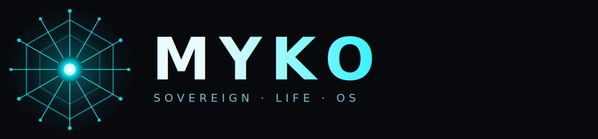

<div align="center">
  <a href="https://github.com/SativusCrocus/MYKO">
    
  </a>

  <p>
    <strong>A local-first, decentralized Life OS.</strong><br/>
    Goose is the brain. The user owns every key. AI executes, never controls.
  </p>

  <p>
    <a href="#install"></a>
    <a href="#install"></a>
    <a href="#install"></a>
    
    
  </p>

  <p>
    <a href="#about">About</a> ·
    <a href="#architecture">Architecture</a> ·
    <a href="#install">Install</a> ·
    <a href="#tool-registry">Tools</a> ·
    <a href="#security">Security</a> ·
    <a href="#verify">Verify</a>
  </p>
</div>

---

## About

**MYKO** is a sovereign operating layer for your digital life.

It is an encrypted vault, a decentralized identity, and a programmable value rail, all wired together into a single desktop app that an LLM can drive on your behalf via [Model Context Protocol](https://modelcontextprotocol.io/) tools. Every sensitive byte is encrypted with a key derived from *your* passphrase (optionally bound to a hardware YubiKey). The bridge binds only to `127.0.0.1`. Nothing phones home.

**What it is not.** Not a cloud service. Not a hosted wallet. Not a chat wrapper. There is no MYKO server, no MYKO account, no MYKO in the middle. The AI has *tools*, not authority — it can request an action, but spend caps, the passphrase, and the hardware key live with you.

> **Sovereign manifesto.** The user owns every key. The AI executes, never controls. The vault is encrypted at rest and in transit. Keys never touch the network in plaintext. Spend is capped, audited, and reversible in intent. Sovereignty is the default.

---

## Architecture

Four sovereign layers, two local processes, zero servers.

```
┌─────────────────────────────────────────────────┐
│                   User's Machine                │
│                                                 │
│  ┌──────────┐    stdio     ┌──────────────────┐ │
│  │  Goose   │◄────────────►│  MCP Server      │ │
│  │  (LLM)   │              │  backend.main    │ │
│  └──────────┘              └────────┬─────────┘ │
│                                     │ imports   │
│  ┌──────────┐    HTTP      ┌────────┴─────────┐ │
│  │  Tauri   │◄────────────►│  Bridge Server   │ │
│  │  (UI)    │  :9473       │  backend.bridge  │ │
│  └──────────┘              └────────┬─────────┘ │
│                                     │ imports   │
│                         ┌───────────┴──────────┐│
│                         │   Shared Backend     ││
│                         │ crypto · storage ·   ││
│                         │ vault · nostr ·      ││
│                         │ lightning            ││
│                         └───────────┬──────────┘│
│                                     │           │
│                  ┌──────────────────┼────────┐  │
│                  ▼                  ▼        ▼  │
│              ~/MYKO/           Kubo IPFS   LND/ │
│              manifest.enc      :5001       LNbits│
│              logs/                              │
└─────────────────────────────────────────────────┘
```

| # | Layer | Stack | Responsibility |
|---|---|---|---|
| **01** | Brain + Memory | MCP stdio · PBKDF2-600k + AES-256-GCM · Kubo IPFS | Encrypted vault, manifest, cross-process locking |
| **02** | Identity | Nostr · BIP-340 Schnorr · NIP-01/13/17/44 | Key derivation, signed events, gift-wrapped DMs |
| **03** | Value | Lightning · LND (macaroon+TLS) · LNbits | Invoices, payments, per-task & daily spend caps |
| **04** | Interface | Tauri 2 · React 19 · Three.js · FastAPI | Desktop shell, animated dashboard, local HTTP bridge |

---

## Prerequisites

- **Python** 3.12 or 3.13
- **Node.js** 20+
- **Rust + Cargo** (Tauri build)
- **Kubo (IPFS)** — default RPC at `http://127.0.0.1:5001/api/v0`
- **LND** or **LNbits** instance (for Lightning)
- **[Goose](https://block.github.io/goose/)** configured to register MCP servers
- *Optional* — YubiKey + `ykman` CLI, for hardware-bound key derivation

---

## Install

### 1. Clone and create a venv

```bash
git clone https://github.com/SativusCrocus/MYKO.git
cd MYKO
python3.13 -m venv .venv
source .venv/bin/activate
pip install -r requirements.txt
```

### 2. Install frontend dependencies

```bash
cd frontend
npm install
cd ..
```

### 3. Configure secrets

```bash
cp .env.example .env
# edit — MYKO_PASSPHRASE, LIGHTNING_API_KEY, etc.
chmod 600 .env
```

Update `goose/goose_config.yaml` — replace `/absolute/path/to/myko` with your real checkout path.

---

## Run

```bash
# 1. Kubo
ipfs daemon

# 2. Your Lightning node (LND or LNbits) per its own docs.

# 3. Local bridge (HTTP, feeds the Tauri UI)
python -m backend.bridge

# 4. Desktop UI
cd frontend && npm run tauri dev

# 5. MCP server is spawned automatically by Goose on the first tool call.
```

---

## Verify

```bash
pytest tests/ -v          # 69 tests should pass
cd frontend && npx tsc --noEmit   # frontend typecheck
```

End-to-end acceptance test against a running Kubo daemon:

```bash
MYKO_PASSPHRASE=test-e2e-pw python scripts/e2e_vault.py
```

Stores a random payload through the encrypted vault, lists the manifest, retrieves the CID, decrypts, and byte-compares against the original. Exits 0 on success. Pass `--file <path>` to store a specific file.

Ask Goose:

> *Store a file called `hello.txt` with the content "hi" in the vault.*
> *List the vault.*
> *Retrieve hello.txt.*

Watch the dashboard — the `GooseStatus` panel pulses blue on each tool call and the audit feed shows the three vault actions.

---

## Tool Registry

All tools exposed to the LLM via MCP:

| Tool | Purpose |
|---|---|
| `vault_store` | Encrypt + pin a file to the IPFS-backed vault. |
| `vault_retrieve` | Fetch + decrypt a file by CID. |
| `vault_list` | List all vault entries. |
| `ipfs_pin_directory` | Hash + pin an entire local directory. |
| `nostr_broadcast` | Sign + broadcast a Nostr event (supports NIP-13 PoW). |
| `nostr_encrypt_dm` | Send an NIP-17 gift-wrapped, NIP-44 encrypted DM. |
| `lightning_balance` | Report current Lightning balance in sats. |
| `lightning_create_invoice` | Create a BOLT11 invoice. |
| `lightning_pay` | Pay a BOLT11 invoice, gated by per-task + daily spend caps. |

---

## Security

1. **Passphrase → key** — PBKDF2-SHA256, **600 000** iterations, unique salt per encryption, AES-256-GCM for authenticated encryption.
2. **Hardware binding** *(optional)* — set `YUBIKEY_ENABLED=true`. Master key becomes `passphrase ‖ HMAC-SHA256(yubikey_challenge, salt)`. Requires `ykman` on `PATH`.
3. **Memory hygiene** — `secure_wipe()` in `finally` blocks overwrites sensitive buffers as soon as they're spent.
4. **Constant-time compares** — session-token & HMAC validation use `hmac.compare_digest`.
5. **Process sandboxing** *(recommended)* — on Linux, run under a dedicated user or wrap with `firejail` / `bwrap`; on macOS, use `sandbox-exec`.
6. **No secrets in logs** — audit log stores only SHA-256 hashes of tool inputs/outputs. Never preimages, passphrases, macaroons, or plaintext.
7. **File permissions** — `.env`, `manifest.enc`, and `.session_token` are written `0600`.
8. **Localhost only** — bridge binds to `127.0.0.1`, CORS is locked to `tauri://localhost`, and the Tauri CSP rejects external URLs.

---

## File layout

```
myko/
├── assets/                  Logo + wordmark (SVG)
├── backend/                 MCP server · vault · Nostr · Lightning · HTTP bridge
├── frontend/                React 19 + Three.js Tauri desktop app
│   ├── public/              favicon, logos
│   ├── src/                 components, hooks, api
│   └── src-tauri/           Rust Tauri shell
├── goose/                   Goose profile + sovereign manifesto
├── landing/                 Static marketing page (Vercel)
├── tests/                   pytest suite (69 tests)
├── requirements.txt
├── vercel.json              Vercel deploy config for landing/
└── README.md                you are here
```

---

## Landing page

A static marketing page lives in [`landing/`](landing/) and deploys to Vercel via the root `vercel.json`. It is self-contained — only `index.html`, `styles.css`, and the SVG assets — with no build step.

---

## License

MIT — see [LICENSE](LICENSE).

---

<div align="center">
  <sub>
    Built to be owned, not rented. Runs entirely on your machine.<br/>
    <em>SOVEREIGN · LIFE · OS</em>
  </sub>
</div>
